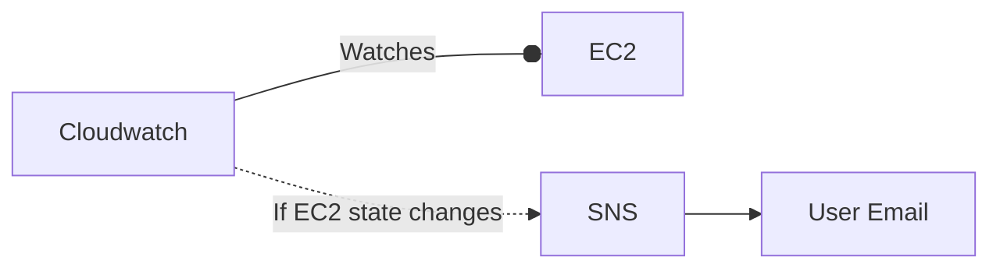

# AWS SNS-Cloudwatch Example: Watch for Changes in an EC2

## Status

**Not Working.**

- [ ] There is no email which comes to my address.  I'm unsure why.  Should debug.

## Description

We set up AWS resources to email us when there is a change in an EC2 instance.  The architecture is as follows:



## Quickstart

Terraform will build all of the resources needed.  Note that you will need to add your email address to `sns.tf`.  

```bash
terraform init
terraform plan  # make sure things look good.
terraform apply
```

## Notes

- **REMEMBER TO CONFIRM YOUR EMAIL (james.c.salvatore.services@gmail.com, or whatever you put into `sns.tf`) IN ORDER TO TERRAFORM DESTROY.**
